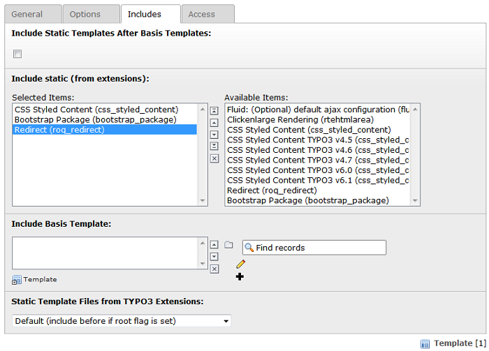
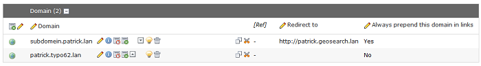

============================
Administrator Manual
============================

Target group: **Administrators**

Installation
=============

* Install the extension with the key **roq_redirect** in the Extension Manager.
* Include the **Redirect (roq_redirect)** static template in your TypoScript (root) template (see Image 6).
* **Adding privileges** to the editors and you're ready to go.

**Image 6:** Static template

Default configuration TYPO3
=======================

The redirect extension assumes that the default setup in TYPO3 is correct, which means:

* The **config.baseURL** is set in TypoScript.
* At least one domain record has been defined. Please make sure that you set the **leading domain record above other domain records**, if you have multiple domain records defined.

**Image 7:** Domain records