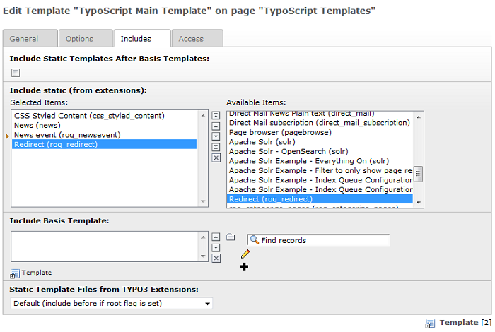
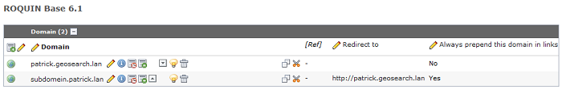

============================
Administrator Manual
============================

Target group: **Administrators**

Installation
=============

* Install the extension with the key **roq_redirect** from the Extension Manager
* Include the **Redirect (roq_redirect)** static template
* And you're ready to go!!!

**Image 4:** Static template

Default configuration TYPO3
=======================

The redirect extension assume that the default setup in TYPO3 is correct.

Domain records
^^^^^^^^^^^^^^^^^^

When you have multiple domain records for one installation, always put the leading domain record above the other domain
records.

**Image 5:** Domain records