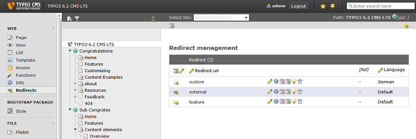

.. ==================================================
.. FOR YOUR INFORMATION
.. --------------------------------------------------
.. -*- coding: utf-8 -*- with BOM.

.. include:: ../Includes.txt

=====================
Introduction
=====================

What does it do?
-----------

Backend module for managing redirects. This extension provides a backend module for managing redirects for
multiple sites and languages. The extension hooks into a preprocess request and checks for a redirect record with the
same url as the requested url. If a redirect record exist for this request, than the extension executes the actual
redirect.

**Image 1:** Redirect backend module

Features
-----------

* Redirect to internal page, external url or internal file
* Counter for total hits of the redirect
* Add additional params for linking inside a part of the internal website page
* Automatic authorization per site for editors based on mounts
* Warning if redirect source url already exist

Background
-----------

* Compatible with TYPO3 CMS 6.1.X and TYPO3 CMS 6.2.X LTS
* The extension is based on Extbase and Fluid
* Documentation is based on ReST
