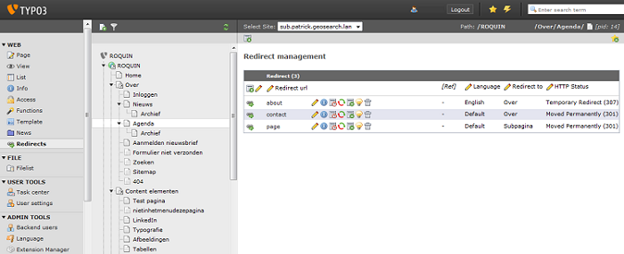

.. ==================================================
.. FOR YOUR INFORMATION
.. --------------------------------------------------
.. -*- coding: utf-8 -*- with BOM.

.. include:: ../Includes.txt

=====================
Introduction
=====================

What does it do?
-----------

Backend module for managing redirects. This extension provides a backend module for managing redirects for
multiple sites and languages. The extension hooks into a preprocess request and checks for a redirect record with the
same url as the requested url. If a redirect record exist for this request, than the extension executes the actual
redirect.

* TYPO3 6.1.X
* The extension is based on Extbase and Fluid
* Documentation is based on ReST

**Image 1:** Redirect backend module
