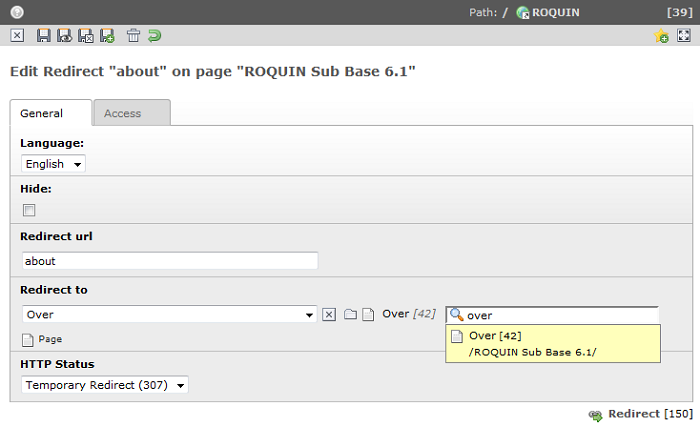

.. ==================================================
.. FOR YOUR INFORMATION
.. --------------------------------------------------
.. -*- coding: utf-8 -*- with BOM.

.. include:: ../Includes.txt

=====================
Users manual
=====================

Target group: **Editors**

Redirect records
-----------

Selecting site
^^^^^^^^^^
You can manage all redirects with the redirect backend module. If you have a multisite environment than you have to select
the site before adding a redirect.

.. figure:: ../Images/selectSite.PNG
    :alt: Select site
    :align: left
    :name: Select site

**Image 2:** Select site

Redirect record
^^^^^^^^^^

After selecting the site in the selectbox you can add, update and remove your redirects for a specific website. So you
can redirect all incoming requests for a specific site to an existing normal TYPO3 page.

**Image 3:** Redirect record

Redirect record fields
-----------

The following table describes the main fields of a redirect record.

.. t3-field-list-table::
 :header-rows: 1

 - :Field:
    Field:

   :Description:
    Description:

 - :Field:
    **Redirect url**

   :Description:
    The incoming request url after the domain. For example, you fill in *"about"* in the field redirect url for the
    incoming request *"http://www.domain.com/about"*.

 - :Field:
    **Redirect to**

   :Description:
    Select the destination of the redirect. The destination of the redirect is a normal TYPO3 page that you can select
    with the selector or the wizard.

 - :Field:
    **HTTP Status**

   :Description:
    The HTTP state of the redirect. It can be a 301 (Moved Permanently), 302 (Found), 303 (See other) and 307
    (Temporary redirect).

