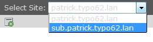
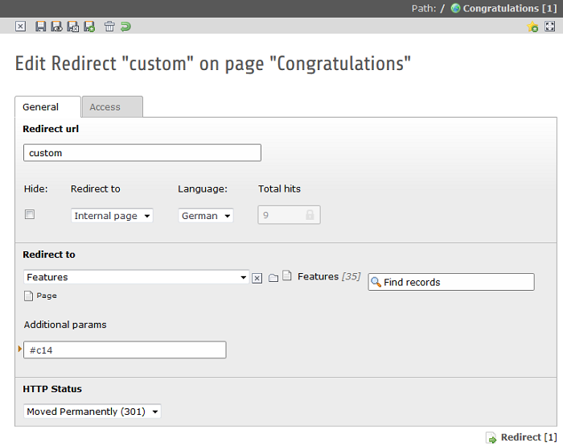
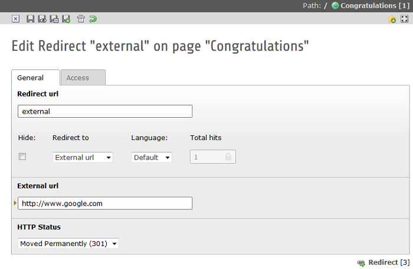
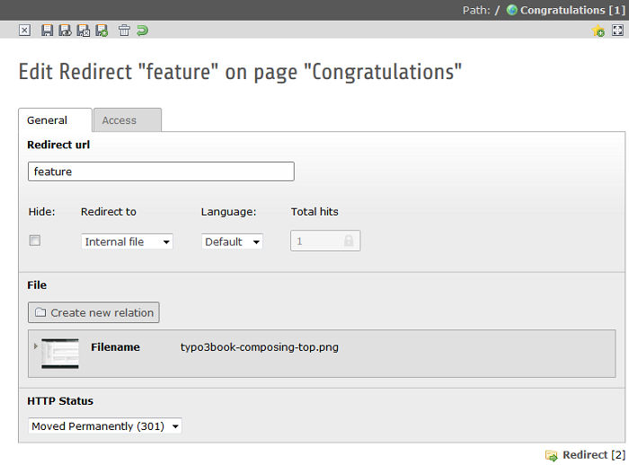

.. ==================================================
.. FOR YOUR INFORMATION
.. --------------------------------------------------
.. -*- coding: utf-8 -*- with BOM.

.. include:: ../Includes.txt

=====================
Users manual
=====================

Target group: **Editors**

Manage redirect records
-----------
Redirects are configurable with the redirect backend module in the TYPO3 backend. Just select the Redirects module in the backend of TYPO3. If
you have a multisite environment than you will have multiple options of sites to select. Choose and select the site you want to add redirects
to (see also image 2). The selected site is the base url of the redirect. For example: You select the site *"sub.patrick.typo62.lan"* and add
a redirect of the type *"Internal Page"* with the same data as image 3 "Redrect type Internal Page" (see also image 3). The url
http://sub.patrick.typo62.lan/custom will redirect to http://sub.patrick.typo62.lan/de/customizing.html#c14.

is the base
url of the actual redirect.

**Image 2:** Select site

Redirect record
^^^^^^^^^^

After selecting the site in the selectbox you can add, update and remove your redirects for a specific site. So you
can redirect all incoming requests for a specific site to an internal page, external url or internal file. So the first thing
you need to do is choose a redirect type.

Redirect type Internal Page
""""""""""

**Image 3:** Redirect record internal page

Redirect type External url
""""""""""

**Image 4:** Redirect record external url

Redirect type Internal File
""""""""""

**Image 5:** Redirect record internal file

Redirect record fields
-----------

The following table describes the main fields of a redirect record.

.. t3-field-list-table::
 :header-rows: 1

 - :Field:
    Field:

   :Description:
    Description:

   :Types Redirect:
	Types Redirect:

 - :Field:
    **Redirect url**

   :Description:
    The incoming request url after the domain. For example, you fill in *"about"* in the field redirect url for the
    incoming request *"http://www.domain.com/about"*.

   :Types Redirect:
	Internal page, external url and internal file.

 - :Field:
    **HTTP Status**

   :Description:
    The HTTP state of the redirect. It can be a 301 (Moved Permanently), 302 (Found), 303 (See other) and 307
    (Temporary redirect).

   :Types Redirect:
   	Internal page, external url and internal file.

 - :Field:
    **Total hits**

   :Description:
    Redirect hit counter number. This is not editable.

   :Types Redirect:
   	Internal page, external url and internal file.

 - :Field:
    **Redirect to**

   :Description:
    Select the destination of the redirect. The destination of the redirect is a normal TYPO3 page that you can select
    with the selector or the wizard.

   :Types Redirect:
   	Internal page

 - :Field:
	**Addtional params**

   :Description:
	Add additional params to the internal page for anchor linking. For example *"#c8"*

   :Types Redirect:
	Internal page

 - :Field:
	**External url**

   :Description:
	The external url to redirect to. For example *"http://www.google.com"*.

   :Types Redirect:
	External url

 - :Field:
	**Internal file**

   :Description:
	The internal file from FAL to redirect to. It saves the file reference id.

   :Types Redirect:
	Internal file

